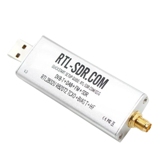

# Práctica RTL-SDR
En esta práctica vamos a escuchar la radio con un dispositivo RTL-SDR. Para ello vamos a utilizar el script radio.py que se encuentra en este repositorio. La idea es que el script nos permita escuchar la radio en tiempo real en la salida de audio que nosotros prefiramos. Para ello vamos a utilizar la librería pyrtlsdr que nos permite interactuar con el dispositivo RTL-SDR.

Un dispositivo RTL-SDR es un dispositivo que nos permite recibir señales de radio en un rango de frecuencias de 24 MHz a 1.7 GHz. Este dispositivo es muy barato y se puede comprar en cualquier tienda online. En este caso vamos a utilizar el dispositivo RTL2832U que se puede comprar en Amazon por 30€. 



Las aplicaciones de este dispositivo son prácticamente infinitas, solo estamos limitados en la tasa de muestreo que nos permite el dispositivo. Podríamos conseguir una tasa de muestreo superior si utilizamos un dispositivo Ettus USRP por ejemplo, pero estos dispositivos son mucho más caros.

La máxima tasa de muestreo que admite este dispositivo es de 3.2 MS/s, lo que nos permite recibir señales de radio FM sin problemas, ya que la tasa de muestreo de la señal de radio FM es de 1.5 MHz.
## Instalación de dependencias
Crea un entorno virtual de conda con versión de Python 3.6

```bash
conda create -n sdr_fm python=3.6
conda activate sdr_fm
```

```
pip install numpy pyaudio pyrtlsdr scipy 
```
## Ejecución del script
Tenemos los siguientes parámetros de configuración:

* --freq (`int`): frecuencia en Hz a la que vamos a escuchar la radio
* --save (`bool`): si se especifica, se guarda la señal de radio en un fichero de audio

Ejemplo de ejecución:

```
python listen.py --freq 98000000 --save True
```
---
## Explicación del script

En primer lugar importamos las librerías necesarias para el desarrollo del proyecto.

```python
import sys
from typing import List
from rtlsdr import RtlSdr
import argparse
import datetime
import numpy as np
import pyaudio
import scipy.signal as sg
import signal
import wave
```

Inicializamos las variables que vamos a utilizar y la salida de audio para nuestro dispositivo. Aquí indicamos la frecuencia que queremos sintonizar y si queremos guardar el audio en un archivo.

```python
SampleStream = List[float]
AudioStream = List[int]
audio_rate = 48000
# Inicializar dispositivo de salida de audio
audio_output = pyaudio.PyAudio().open(format=pyaudio.paInt16, channels=1, rate=audio_rate, output=True)
audio_data = []
```
Esta función se encargará de guardar los datos de audio en un archivo. Para ello, se le pasa como parámetro el nombre del archivo y los datos de audio hasta el momento en el que se detiene la ejecución del script.

```python
def save_audio_data_to_file():
    filename = f"audio_{datetime.datetime.now().strftime('%Y%m%d%H%M%S')}.mp3"
    audio_data_bytes = np.array(audio_data).tobytes()
    with wave.open(filename, 'wb') as wf:
        wf.setnchannels(1)  # Número de canales (1 para mono, 2 para estéreo)
        wf.setsampwidth(2)  # Ancho en bytes de cada muestra
        wf.setframerate(48000)  # Tasa de muestreo en Hz
        wf.writeframes(audio_data_bytes)
```
**Función para manejar la interrupción del teclado (Ctrl+C)**: Gracias a esta función, podremos interrumpir en todo momento la ejecución del script, deteniendo la reproducción de audio y cerrando el dispositivo RTL-SDR. En caso de que hayamos indicado en la configuración que queremos guardar el audio, se guardará el archivo y se cerrará. 

```python
def signal_handler(sig, frame):
    global sdr
    sdr.cancel_read_async()
    if args.save:
        save_audio_data_to_file()
    print("Ctrl+C detectado. Liberando recursos...")
    sdr.close()
```
Con esta función controlamos la reproducción de audio, redireccionándolo a la salida de audio de nuestro dispositivo. En caso de que queramos que se guarde el audio al finalizar la ejecución, iremos añadiendo los datos de audio a una lista.

```python
def stream_audio(data: AudioStream):
    if args.save:
        audio_data.append(data)
    audio_output.write(data)
```
La función *process* se encarga de transformar las muestras de radiofrecuencia en una señal de audio que puede ser reproducida.

```python
def process(samples: SampleStream, sdr: RtlSdr) -> None:
    sample_rate_fm = 240000
    iq_comercial = sg.decimate(samples, int(sdr.get_sample_rate()) // sample_rate_fm)

    angle_comercial = np.unwrap(np.angle(iq_comercial))
    demodulated_comercial = np.diff(angle_comercial)
    audio_signal = sg.decimate(demodulated_comercial, sample_rate_fm // audio_rate, zero_phase=True)
    audio_signal = np.int16(14000 * audio_signal)

    stream_audio(audio_signal.astype("int16").tobytes())
```
Finalmente, inicializamos el dispositivo RTL-SDR y comenzamos a escuchar la frecuencia indicada en la configuración. 

```python
parser = argparse.ArgumentParser(formatter_class=argparse.ArgumentDefaultsHelpFormatter)
parser.add_argument('--freq', type=int, default=93900000,
                    help='frequency to listen to, in Hertz')
parser.add_argument('--save', type=bool, default=False,
                    help='Store audio to file')

args = parser.parse_args()
sdr =  RtlSdr()
signal.signal(signal.SIGINT, signal_handler) 
try:
    sdr.rs = 240000
    sdr.fc = args.freq
    sdr.gain = 'auto'
    sdr.err_ppm = 40
    sdr.read_samples_async(process, int(sdr.get_sample_rate()) // 16)
finally:
    sys.exit(0)
```